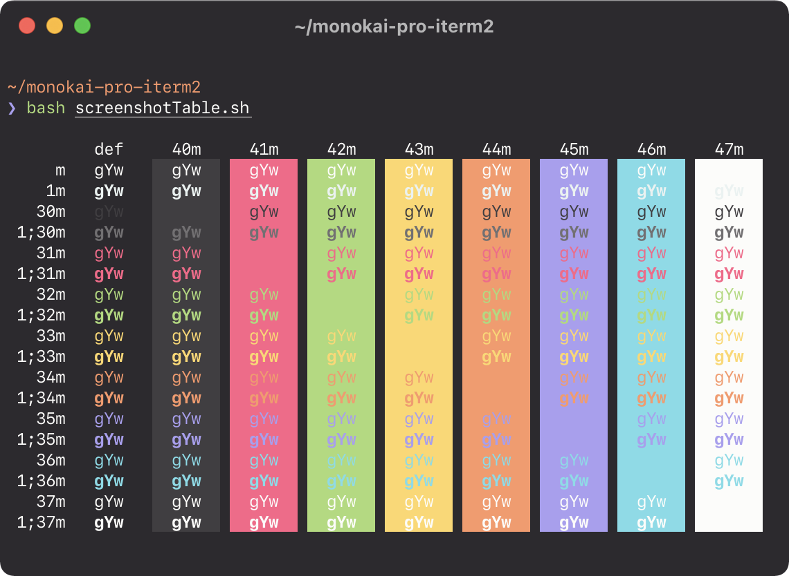
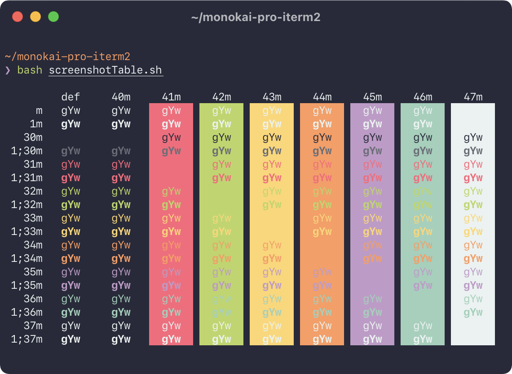
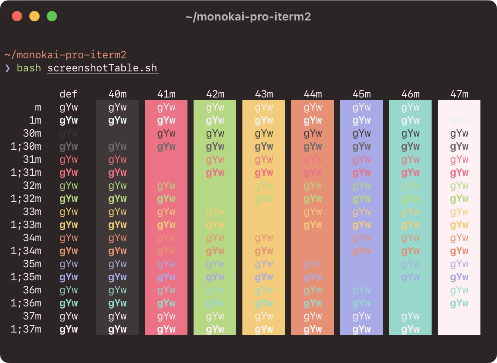
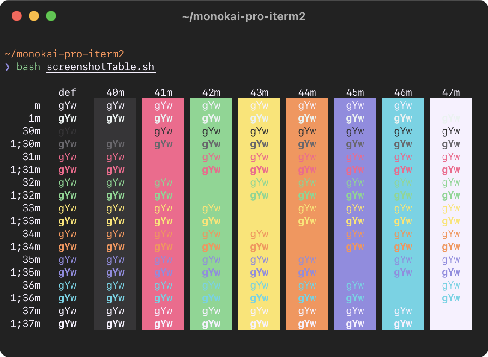
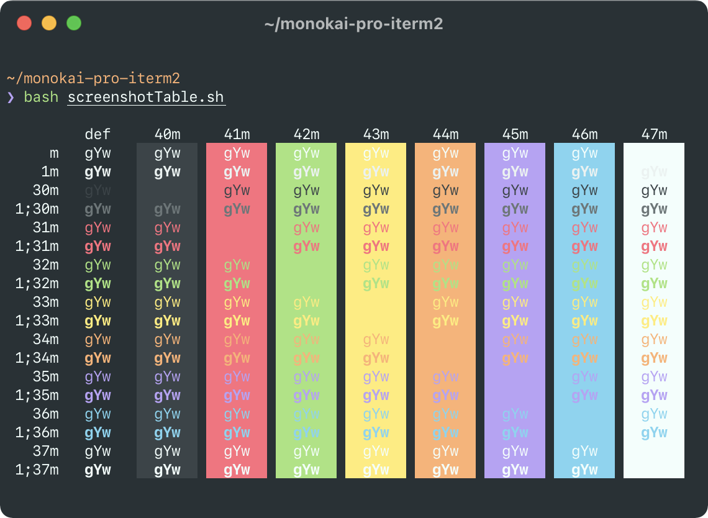
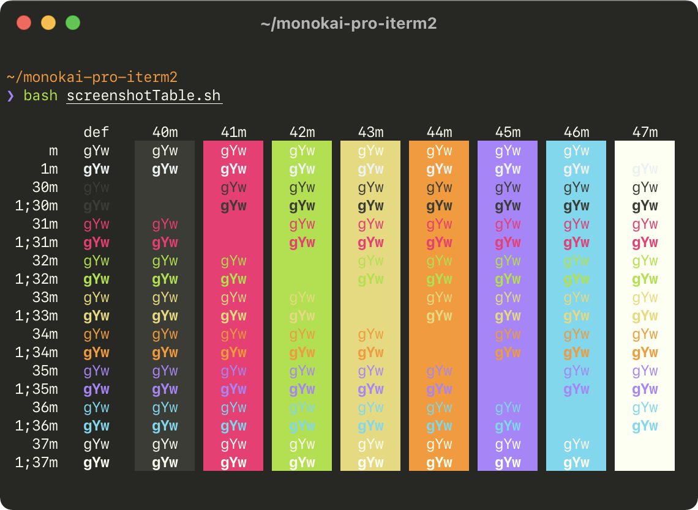

# Monokai Pro for iTerm2

A port of the beautiful [Monokai Pro](https://monokai.pro) color scheme for Sublime Text and VS Code to iTerm2.

## Screenshots

### Monokai Pro

### Monokai Pro (Filter Octagon)

### Monokai Pro (Filter Ristretto)

### Monokai Pro (Filter Spectrum)

### Monokai Pro (Filter Machine)

### Monokai Classic
